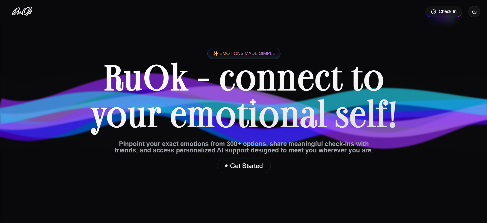

# RuOk ✨
>Your emotional wellness companion that helps you understand, track, and manage your mental health with precision and care.



## What RuOk Does 🚀
Ru-Ok is a comprehensive mental health application that empowers users to navigate their emotional landscape through detailed emotion tracking, 
AI-powered support, and personalized wellness tools designed to transform emotional awareness into lasting wellbeing.

## Problem  🎯
Many individuals face significant barriers in managing their emotional wellbeing:

- **Limited Emotional Vocabulary** - People struggle to articulate their feelings beyond basic terms, lacking the precise language needed to identify complex emotional states
- **Oversimplified Tracking Tools** - Traditional mood tracking apps reduce complex emotions to generic categories like "happy" or "sad," failing to capture the nuanced reality of human feelings
- **Lack of Actionable Support** - Most apps collect emotional data but provide minimal guidance on how to actually address or manage different emotional states
- **Minimal Access to Timely Resources** - Mental health support is often expensive, unavailable, or requires long wait times, leaving people without immediate help when needed
- **Gap Between Feeling and Understanding** - Users can sense something is wrong but can't pinpoint exactly what they're experiencing, creating confusion and frustration
- **Barriers to Effective Self-Care** - Without proper emotional identification and support tools, individuals struggle to develop healthy coping mechanisms and emotional regulation strategies

## Our Solution 💡
Ru-Ok bridges this gap by providing a sophisticated yet accessible platform that meets users wherever they are on their mental health journey. We're building a comprehensive emotional wellness ecosystem that combines precision tracking with intelligent support.

## Current Features 🔍

### Precision Emotion Tracking
- Choose from 300+ carefully curated emotions to accurately identify your feelings
- Move beyond generic mood categories to understand your emotional nuances
- No more settling for "fine" when your emotions deserve better description

### Smart Categorization System
Classify emotions with contextual tags across three key categories:
- Activity: What you were doing when you felt this emotion
- Place: Where you were when the emotion occurred
- People: Who you were with during the emotional experience
  
Build comprehensive emotional context for better pattern recognition

### AI Companion Chat (Sage)
- Context-aware chatbot that understands your emotional journey
- Remembers your previous check-ins and provides personalized guidance
- Available 24/7 for emotional support and conversation
- Trained specifically for mental health and wellness conversations

### Personalized Wellness Toolkit

- Curated tools and techniques tailored to specific emotional needs
- Variety of coping mechanisms for different types of emotions
- Evidence-based strategies for emotional regulation and wellbeing
- Adaptive recommendations based on your emotional patterns


### Emotional Analytics

- Track your emotional patterns over time
- Identify triggers and growth areas
- Visualize your mental health progress with intuitive charts and insights

##  Future Roadmap
### Social Connection Features

- Friend Check-ins: Share meaningful emotional updates with your trusted circle
- Peer Support Chat: Connect authentically with friends through the app
- Community Wellness: Foster deeper relationships through genuine emotional transparency

### Note to Self System

- Scheduled Self-Messages: Send future messages to yourself based on emotional patterns
- Emotion-Triggered Reminders: Receive personalized notes when experiencing specific emotions
- Time-Based Wellness: Schedule motivational and supportive messages for challenging times

## Tech Stack ⚙️

- **Frontend**: React 
- **Backend**: Node.js + Express
- **Database**: MongoDB 
- **AI/ML**: Gemini 2.5 flash + Groq

## Backend code available [here](https://github.com/iamtanishqsethi/RUOK-backend)

## Installation
1. Clone the repository:
   ```bash
   git clone https://github.com/iamtanishqsethi/RUOK-frontend
   ```
2. Navigate to the project directory:
   ```bash
   cd RUOK-frontend
   ```
3. Install dependencies:
   ```bash
   npm i 
   ```
4. Run the application:
   ```bash
   npm run dev
   ```
The app will be available at ```http://localhost:5173/```
 
## Created By :

[Suvrat Mittal](https://github.com/suvrat007), [Chehak Sharma](https://github.com/ch3hak), [Tanishq Sethi](https://github.com/iamtanishqsethi/)


